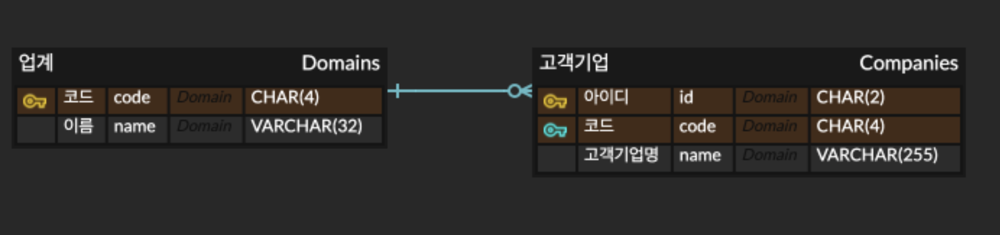

# 디비 디비 딥(DB DB Deep) 스터디 2회차

## [ 데이터베이스 첫걸음 ] 7장 트랜잭션과 동시성 제어 - 복수의 쿼리 통합

### 

## [ 데이터베이스 첫걸음 ] 8장 테이블 설계의 기초 - 테이블의 개념과 정규형

### 테이블 설계의 기초

#### 관계형 데이터베이스가 주류가 된 이유

여러 데이터베이스가 있음에도 불구하고 관계형 데이터베이스가 표준 데이터베이스 제품이 된 이유 중 하나는 데이터 정합성을 높이기 위한 설계 노하우가 매우 발달했기 때문이다.

여기서 데이터 정합성(Data Consistency)이란 데이터의 값이 서로 일치하는 상태를 의미하며, 정규형을 지키지 않아 갱신 이상 같은 이상현상(Anomaly)이 발생하면 정합성이 지켜지지 않는다. 쉽게 테이블 내 중복된 값이 존재할 때 하나의 값은 수정이 되었는데, 다른 하나의 값은 수정되지 않은 경우를 떠올리면 좋다. 이와 유사하게 데이터 무결성(Data Integrity)이 존재하는데, 이는 데이터의 값이 정확해야 함을 의미한다. 예를 들어 주문정보 테이블의 고객번호 값이 모두 `-1`로 입력되어 있고 고객정보 테이블에서 또한 마찬가지로 `-1`로 입력되어 있는 상황을 가정해보자. 이때 고객번호의 값은 `1` 이상의 값이어야 할 경우 `-1` 값을 가지는 고객번호의 경우 데이터의 값이 서로 일치하기 때문에 데이터 정합성은 지켜졌지만, 유효하지 않은 값을 가지고 있기 때문에 데이터 무결성은 지켜지지 못했다고 할 수 있다.

데이터 무결성의 종류는 크게 아래와 같이 네 가지가 있다.

1. 개체 무결성(Entity Integrity): 식별자(Identifier)에 의해 지켜질 수 있는 무결성으로 모든 인스턴스는 고유한 값 또는 `NULL` 값을 가지지 않는 속성이나 속성 그룹을 가져야 한다는 것을 의미한다.
2. 분야 무결성(Domain Integrity): 기본 값이나 `NULL` 값 허용 여부, 그리고 체크 조건 등을 통해 지켜질 수 있는 무결성으로 개체의 특정 속성 값은 데이터 타입, 길이, 유효 값 등이 일관되게 동일한 범주의 값만 존재해야 한다는 것을 의미한다.
3. 참조 무결성(Referential Integrity): 외래키 제약조건(Foreign Key Constraint)을 통해 지켜질 수 있는 무결성으로 개체의 외래 식별자 속성은 참조되는 개체의 주 식별자 값과 일치하거나 `NULL` 값이어야 한다는 것을 의미한다.
4. 업무 무결성(Business Integrity): 트리거(Trigger) 등을 통해 지켜질 수 있는 무결성으로 기업에서 업무를 수행하는 방법이나 데이터를 처리하는 규칙을 의미한다.

#### 테이블 설계는 논리의 세계

테이블 설계를 '논리 설계'란 말로 부르는 경우가 있다. 서버나 스토리지 같은 물리층과 관계 없이 독립적으로 작성하는 것이 가능하기 때문이다. 물론 성능이 중요한 경우에는 테이블 설계에서도 물리적인 측면을 고려해야 하며, 논리 설계와 물리 설계의 구분은 결국 물리적인 자원이 충부하고 풍부하다는 가정 아래 소프트웨어 세계는 물리 세계를 생각하지 않아도 괜찮은 이상적인 상태를 전제로 한다.

#### 테이블이란

테이블은 관련성이 있는 것이 모인 공통적인 요소의 집합을 의미한다.

#### 테이블은 공통 속성을 가진 것의 집합이다

관계형 데이터베이스에서 테이블은 각각의 행이 어떤 공통적인 특징을 가진 집합이어야 하며, 이것이 테이블 설계의 제1 규칙이다. 이 규칙을 데이터베이스 세계에서는 테이블명은 반드시 복수형이나 집합명사로 표현해야 한다고 표현한다.

### 테이블 설계 규칙

#### 사물과 사물의 집합은 계층이 다르다.

테이블의 구성 패턴은 자의적인 구분을 고려한다면 얼마든지 늘릴 수 있다. 관계형 데이터베이스는 인간의 인식을 반영하는 거울이기도 한데, 이는 자의적으로 개념을 만들어서 집합을 나누는 인간의 자유로운 사고도 반영한다는 의미도 된다. 그리고 이것은 데이터베이스 테이블 설계가 어려운 원인이 된다. 무절제한 자유와 규칙을 허용하기 때문이다.

과거에 관계형 데이터베이스의 테이블 설계를 프로그램으로 자동화하려는 시도가 있었고, 이 도구를 CASE(Computer Aided Software Engineering) 도구라고 부른다. 그러나 현재도 테이블 제작 방식과 조합의 패턴 수가 너무 많아 기계 판정이 어려워 완전히 자동화되지는 못하고 있다.

#### 가장 상위의 개념집합으로 정리한다.

데이터베이스 테이블 설계의 가장 기본 규칙은 결국 최상위 개념집합으로 정리하는 것이다.

#### 열이란 개체의 속성이다

관계형 데이터베이스를 객체지향 언어의 관점에서 바라본다면 테이블은 클래스(Class)에 해당하고, 각 행은 실체화된 인스턴스(Instance)에 해당한다. 관계형 데이터베이스 중에도 이러한 객체지향 언어의 특징을 반영하려는 시도가 있는데, 대표적으로 PostgreSQL의 경우 테이블에 대해 상속(Inherit)을 정의할 수 있다.

#### 기본키의 값이 바뀌면 왜 곤란한가

크게 아래와 같이 두 가지 이유가 있다.

1. 변경 후 값의 유일성을 보증할 수 없다.
2. 과거 데이터와의 결합(매칭)이 어렵다.

결국 데이터 관리는 데이터를 저장한 그 시점에만 정합성이 있는 것이 아닌 장기적으로 정합성을 유지할 수 있게 노력해야 하는 작업이다. 테이블은 결국 정적이지 않고 동적이기 때문이다. 물론 이러한 맥락에서 완전히 정적인 데이터의 경우, 다시 말해 데이터를 저장한 이후 변경이 전혀 없는 유형의 데이터라면 기본키 관리가 그다지 엄격하지 않아도 괜찮다. 예를 들어 이력 데이터와 같이 과거 일어난 사실을 기록한 데이터는 바뀌는 경우가 없기 때문에 정규화도 그다지 엄격하게 실시하지 않는다.

#### 기본키 열로 NULL은 불가

기본키가 레코드를, 다시 말해 한 행을 고유하게 식별할 수 있는 열이란 것은 기본키 열에는 `NULL` 값이 존재해서는 안 된다는 것을 의미한다.

### 정규형

#### 제1정규형(1NF)

제1정규형의 정의는 테이블 셀에 복합적인 값을 포함하지 않는다는 것이다. 이때 더이상 나누는 것이 가능하지 않은 값을 스칼라 값이라 하며, 제1정규형이란 결국 스칼라 값 이외의 값을 포함하지 않는 테이블을 의미한다.

### 테이블은 함수다

만약 복합적인 값을 허용하면 기본키가 있는 행의 값을 고유하게 특정할 수 없게 된다. 이것은 곧 기본키의 정의에도 올바르지 않다. 제1정규형도 결국은 레코드의 단일성을 보증한다는 데이터 정합성의 관점에서 나온 규칙이다.

기본키를 통해 레코드의 열 값 전체가 고유하게 특정된다는 것은 다시 말해 기본키와 그 외의 열 사이에 함수적인 관계가 있다는 것을 의미한다. 여기서 함수란 수식으로 표현하는 것뿐만 아니라 입력과 출력의 대응관계라는 시각으로 받아들여야 한다. 이는 집합론이 발달하며 받아들여지기 시작한 개념으로 관계형 데이터베이스 또한 이론적으로 집합론에 기반을 두기 때문에 함수를 대응관계로 간주하는 생각 방식과 맞다.

기본키와 다른 열 사이에 함수적인 유일성을 관계형 데이터베이스에서는 함수 종속성(Functional Dependency)이라고 하며, 아래와 같이 열을 중괄호(`{ }`)로 감싸서 화살표로 연결해 표현한다.

```
{기본키} -> {특정 열}
```

#### 제2정규형(2NF)

제2정규형은 테이블 전체의 셀이 스칼라 값으로 구성되어 있어 제1정규형을 충족하더라도 부분함수 종속성이 존재하는 경우가 있어 이를 해결하는 정규형이다. 이때 부분함수 종속성은 간단히 기본키를 구성하는 열의 일부에만 함수 종속이 존재하는 것을 의미한다. 예를 들어 주문 테이블에 고객기업 ID, 주문번호, 주문접수일, 그리고 고객기업명이라는 열이 존재한다고 가정해보자. 이때 고객기업 ID와 주문번호의 쌍이 기본키가 될 때 아래와 같은 함수 종속성이 생긴다.

```
{고객기업 ID, 주문번호} -> {주문접수일}
```

그러나 고객기업명의 경우 아래와 같이 고객기업 ID 열에 대해서만 종속성이 생기며, 이는 곧 부분적으로 종속성이 생기는 부분함수 종속성이 발생했음을 의미한다.

```
{고객기업 ID} -> {고객기업명}
```

이와 같은 부분함수 종속의 경우 해당 키와 종속하는 열만 다른 테이블로 만들어 외부로 꺼내야 한다. 예를 들어, 위 고객기업명 열을 고객기업 테이블로 따로 빼내어 데이터를 저장 및 관리하는 것이다.

#### 제2정규형은 왜 필요한가

제2정규형은 갱신 이상이 발생하지 않게 하기 위해 필요하다. 이때 갱신 때 데이터 부정합이 발생하는 것을 갱신 이상이라 한다. 비정규형 테이블은 이 갱신 이상의 위험이 높은 테이블인데, 비정규형 테이블이 올바른 집합 단위에 기초를 두고 있지 않기 때문이다. 따라서 관계형 데이터베이스에서 아름다운 테이블이란 바로 기능적인 테이블을 의미한다.

#### 제3정규형(3NF)

기본키가 1개의 열밖에 없는 경우 자동으로 제2정규형을 만족한다. 따라서 제1정규형과 제2정규형을 만족하는 테이블이 존재할 때 기본키 이외이ㅡ 키 간에 발생하는 추이함수 종속에 의해 갱신 이상이 발생할 수 있어 제3정규형이 필요하다. 예를 들어 고객기업 테이블에 기본키로 고객기업 ID 열을 가지고 있고, 고객기업명, 업계코드, 업계명 열이 추가로 존재한다고 가정해보자. 이때 아래와 같은 추이함수 종속이 존재한다. 다시 말해, 업계코드 열은 기본키가 아님에도 불구하고 업계명 열과 함수 종속성을 가지고 있는 것이다.

```
{업계코드} -> {업계명}
```

따라서 아래와 같이 기본키 관점에서는 2단계에 걸친 함수 종속이 존재한다.

```
{고객기업 ID} -> {업계코드} -> {업계명}
```

이런 추이함수 종속이 존재할 경우 아직 고객이 존재하지 않는 업계를 등록할 수 없기 때문에 문제가 된다. 이를 해결하기 위해서는 제2정규형과 동일하게 테이블을 나누어 외부로 꺼내야 한다.


### ER 다이어그램

#### 너무 많아진 테이블을 어떻게 할까

테이블 간의 관련성을 한눈에 알 수 있게 고안된 기술이 ER 다이어그램(Entity-Relationship Diagram)이다. 이때 엔터티(Entity)란 개체, 다시 말해 테이블을 의미하며, 렐레이션십(Relationship)은 관계, 즉 테이블 간의 관계를 의미한다. 그리고 이를 그래픽으로 이해하기 쉽게 기술할 수 있게 다이어그램을 사용한 것이다.

#### 엔터티란

보통 엔터티 내의 외래키의 경우 FK(Foreign Key)로 표시하며, 외래 테이블의 기본키가 존재하지 않을 경우 해당 키를 외래키로 가지는 값 또한 존재할 수 없다. 이는 테이블에 걸친 제약으로 외래키 제약이라고 부르며, 이것이 ER 다이어그램의 핵심이 되는 요소다.

#### 릴레이션십이란

엔터티 간의 관련성을 표현하는 것이 앞에서 설명한 외래키의 존재다. 이때 외래키가 존재하는 테이블은 해당 열이 다른 테이블의 기본키 열 또는 기본키의 일부 열을 참조하는 것을 의미하며 이 관련성을 렐레이션십(Relationship)이라 한다.

#### 실제로 ER 다이어그램을 작성해 보자

업계 및 고객기업 테이블에 대한 ER 다이어그램을 IE(Information Engineering) 표기법을 기반으로 작성해보면 아래와 같다.



이때 고객기업 테이블 내의 코드 열은 업계 테이블의 기본키를 가리키는 외래키이며, 업계 테이블 입장에서 고객기업 테이블은 복수의 레코드와 연결되거나 아직 연결된 기업이 없어 하나도 존재하지 않을 가능성이 있기 때문에 동그란 기호와 함께 새의 다리와 유사한 모양의 기호가 함께 사용되었다. 반대로 고객기업 테이블 입장에서는 항상 업계 테이블의 하나의 레코드와 대응되기 때문에 수직 선 기호가 사용되었다.

## [ Programmers ] 문제 풀이

### 입양 시각 구하기 (2)

#### 풀이

아래와 같이 공통 테이블 표현식(Common Table Expression, CTE)의 재귀적(Recursive) 사용을 통해 문제를 해결할 수 있다. 이를 통해 0부터 23까지 `UNION ALL` 키워드를 반복하지 않더라도 쉽게 임시 테이블을 생성할 수 있다.

```SQL
WITH RECURSIVE cte (HOUR) AS (
    SELECT 0 AS HOUR
    UNION ALL
    SELECT HOUR + 1 AS HOUR
    FROM cte
    WHERE HOUR < 23
)

SELECT
    cte.HOUR AS HOUR,
    COUNT(ANIMAL_OUTS.ANIMAL_ID) AS COUNT
FROM cte
LEFT JOIN ANIMAL_OUTS
ON cte.HOUR = HOUR(ANIMAL_OUTS.DATETIME)
GROUP BY cte.HOUR
ORDER BY cte.HOUR ASC;
```

### 즐겨찾기가 가장 많은 식당 정보 출력하기

#### 풀이

문제를 풀기 전 문제 조건에 동일한 `FOOD_TYPE` 컬럼 값을 가진 데이터 중에 동일한 `FAVORITES` 값을 가진 데이터가 존재하지 않는다는 조건이 없기 때문에 즐겨찾기의 수가 동일한 식당이 여러 곳일 경우에 대한 예외 처리를 고민해봐야 한다. 그러나 이런 예외 처리에 대한 안내 또한 별도로 없었기에 궁극적으로는 가장 많은 즐겨찾기 수를 보유한 식당은 고유하게 존재한다고 가정하고 문제를 풀게 되었다.

해당 문제는 특정 컬럼을 기준으로 그룹을 만든 뒤에 집계를 내어 문제를 해결하면 될 것으로 판단된다. 그러나 단순히 `GROUP BY` 구와 함께 `MAX` 집계 함수를 사용하여 문제를 풀이하면 문제를 해결할 수 없다.

아래와 같이 쿼리를 실행할 경우 비집계 컬럼인 `REST_ID` 및 `REST_NAME` 필드의 경우 임의의 값을 선정하게 되기 때문에 오류가 발생한다. Programmers의 경우 `sql_mode` 시스템 변수 값이 아무 것도 저장되어 있지 않기 때문에 오류가 발생하지는 않지만 결국 무작위 값을 가져오는 것은 똑같기 때문에 오답 처리가 된다.

```SQL
SELECT
    FOOD_TYPE,
    REST_ID,
    REST_NAME,
    MAX(FAVORITES) AS FAVORITES
FROM REST_INFO
GROUP BY FOOD_TYPE
ORDER BY FOOD_TYPE DESC;
```

따라서 아래와 같이 중첩 서브쿼리(Nested Subquery)면서 동시에 다중열 서브쿼리(Multiple-column Subquery) 서브쿼리를 사용하여 문제를 풀 수 있다.

```SQL
SELECT
    FOOD_TYPE,
    REST_ID,
    REST_NAME,
    FAVORITES
FROM REST_INFO
WHERE (FOOD_TYPE, FAVORITES) IN (
    SELECT
        FOOD_TYPE,
        MAX(FAVORITES) AS MAXIMUM_FAVORITES
    FROM REST_INFO
    GROUP BY FOOD_TYPE
)
ORDER BY FOOD_TYPE DESC;
```

한 가지 주의할 점은 `IN` 연산자의 경우 기본 키(Primary Key, PK)를 대상으로 하더라도 MySQL 버전에 따라 옵티마이저(Optimizer)가 최적화 하지 못할 수 있다는 점이다. 예를 들어, `world` 데이터베이스의 `countrylanguage` 테이블에서 특정 튜플 값을 가지는 데이터만 추출하는 상황을 생각해보자.

먼저 아래와 같이 `IN` 연산자를 `WHERE` 구에 사용하여 조회할 수 있다.

```SQL
SELECT
    CountryCode,
    Language
FROM countrylanguage
WHERE (CountryCode, Language) IN (
    ('ZMB', 'Bemba'),
    ('ZMB', 'Chewa'),
    ('ZMB', 'Lozi'),
    ('ZMB', 'test')
);
```

해당 쿼리의 실행 계획을 MySQL 5.7 버전에서 출력해보면 아래와 같다. 여기서 중요한 점은 `type` 필드인데, `index` 값을 출력했다는 것을 알 수 있다. 이는 다시 말해 인덱스 풀 스캔(Index Full Scan)을 한다는 것을 의미하며, 인덱스 테이블을 스캔할 뿐 통상적인 풀 스캔과 마찬가지로 인덱스 테이블을 전체 한 번 조회해야 하는 것을 의미한다.

```Bash
*************************** 1. row ***************************
           id: 1
  select_type: SIMPLE
        table: countrylanguage
   partitions: NULL
         type: index
possible_keys: PRIMARY,CountryCode
          key: CountryCode
      key_len: 12
          ref: NULL
         rows: 1
     filtered: 100.00
        Extra: Using where; Using index
```

MySQL 8.0 버전 이상부터는 아래와 같은 실행 계획을 출력한다. 5.7 버전과 달리 `range` 값을 출력했다는 것을 알 수 있다. 이는 곧 인덱스 레인지 스캔(Index Range Scan)을 한다는 것을 의미하며, 인덱스를 하나의 값이 아닌 범위로 검색한다는 것을 의미한다.

```Bash
*************************** 1. row ***************************
           id: 1
  select_type: SIMPLE
        table: countrylanguage
   partitions: NULL
         type: range
possible_keys: PRIMARY,CountryCode
          key: CountryCode
      key_len: 132
          ref: NULL
         rows: 4
     filtered: 100.00
        Extra: Using where; Using index
```


반대로 `IN` 연산자가 아닌 비교 연산자를 나열하여 조회할 수 있다.

```SQL
SELECT
    CountryCode,
    Language
FROM countrylanguage
WHERE (
    CountryCode = 'ZMB'
    AND (
        Language = 'Bemba'
        OR
        Language = 'Chewa'
        OR
        Language = 'Lozi'
        OR
        Language = 'test'
    )
);
```

해당 쿼리의 실행 계획을 MySQL 5.7 버전에서 출력해보면 아래와 같다. `type` 필드의 값이 이전 `IN` 연산자를 사용했을 때와 달리 `ref` 값을 출력하고 있다는 것을 알 수 있다. `ref` 값은 동등 비교를 의미하며, 결국 동등한 조건으로만 비교를 하기 때문에 성능이 좋은 레코드 조회 방법 중 하나이다.

```Bash
*************************** 1. row ***************************
           id: 1
  select_type: SIMPLE
        table: countrylanguage
   partitions: NULL
         type: ref
possible_keys: PRIMARY,CountryCode
          key: CountryCode
      key_len: 12
          ref: const
         rows: 4
     filtered: 100.00
        Extra: Using where; Using index
```

MySQL 8.0 버전 이상부터는 아래와 같은 실행 계획을 출력하며 앞서 `IN` 연산자를 사용한 경우와 동일하게 `range` 값을 출력하고 있다는 것을 알 수 있다.

```Bash
*************************** 1. row ***************************
           id: 1
  select_type: SIMPLE
        table: countrylanguage
   partitions: NULL
         type: range
possible_keys: PRIMARY,CountryCode
          key: CountryCode
      key_len: 132
          ref: NULL
         rows: 4
     filtered: 100.00
        Extra: Using where; Using index
```

`IN` 연산자를 사용하는 형태는 크게 두 가지다.

먼저 상수가 사용된 경우다. 상수가 사용된 경우 MySQL 8.0 이전 버전까지는 앞서 살펴봤던 MySQL 5.7 버전의 실행 계획에서 `index` 값이 출력된 것처럼 항상 풀 테이블 스캔(Full Table Scan)을 하였다. 따라서 성능 문제를 해결하기 위해 쿼리를 분할하여 여러 번 실행하고는 했는데, MySQL 8.0 버전부터는 앞서 살펴봤던 실행 계획에서 `range` 값이 출력된 것처럼 인덱스를 최적으로 사용할 수 있게 개선됐다.

다음으로 서브쿼리가 사용된 경우다. MySQL 8.0 이전 버전의 경우 최적화가 상당히 불안했으나 MySQL 8.0 버전부터는 세미 조인의 최적화가 많이 안정화됐다. 여기서 세미 조인이란 한 테이블의 행이 다른 테이블의 행과 일치할 때 첫 번째 테이블의 행만 출력하는 것을 의미한다. 세미 조인을 구현하기 위해 보통 `IN` 연산자 또는 `EXISTS` 연산자를 사용한다.

결론적으로 `IN` 연산자를 사용할 때는 상수가 사용된 경우와 서브쿼리가 사용된 경우를 고려하여 서브쿼리의 경우 최적화에 어려움이 있기 때문에 여러 고민이 필요하다는 점을 인지해야 하고, MySQL 8.0 버전부터 `IN` 연산자에 대한 최적화 작업이 많이 개선되었기 때문에 MySQL 버전 또한 확인할 필요가 있다.

#### 기타

`NOT IN` 연산자의 경우 동등이 아닌 부정형 비교여서 인덱스를 이용해 처리 범위를 줄이는 조건으로는 사용할 수 없기 때문에 실행 계획에서 인덱스 풀 스캔인 `index` 값이 출력 된다. 가끔 인덱스 레인지 스캔인 `range` 값으로 출력되는 경우도 있는데, 이는 InnoDB 테이블에서 기본 키가 클러스터링 키이기 때문일 뿐 실제 `IN` 연산자와 같이 효율적으로 실행된다는 것을 의미하지는 않는다.

예를 들어 앞서 실행한 쿼리의 `IN` 연산자를 `NOT IN` 연산자로 변경하여 MySQL 8.0 버전에서 실행한다고 가정해보자.

```SQL
SELECT
    CountryCode,
    Language
FROM countrylanguage
WHERE (CountryCode, Language) NOT IN (
    ('ZMB', 'Bemba'),
    ('ZMB', 'Chewa'),
    ('ZMB', 'Lozi'),
    ('ZMB', 'test')
);
```

위 쿼리의 실행 계획을 출력해보면 아래와 같다. `type` 필드의 값이 앞서 `range` 값을 출력했던 것과 달리 `index` 값을 출력하고 있다는 것을 확인할 수 있다. 이는 다시 말해 `NOT IN` 연산자는 `IN` 연산자와 달리 부정형 비교 과정에서 인덱스를 이용해 처리 범위를 줄일 수 없기 때문에 인덱스 풀 스캔을 하게 된 것을 의미한다.

```Bash
*************************** 1. row ***************************
           id: 1
  select_type: SIMPLE
        table: countrylanguage
   partitions: NULL
         type: index
possible_keys: PRIMARY,CountryCode
          key: CountryCode
      key_len: 12
          ref: NULL
         rows: 984
     filtered: 96.00
        Extra: Using where; Using index
```
