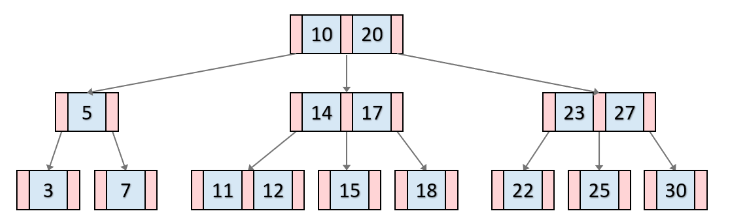

# 10장

# 성능을 생각하자.

## 성능을 측정하는 2가지 지표

- 응답 시간 : 어떤 특정 처리의 시작~종료 시간
- 처리율 : 특정 처리를 단위 시간에 몇 건 처리가 가능한 지

---

## 정점과 한계점

- 정점 (peak) : 데이터 처리량이 가장 많은 타이밍.
- 시스템은 동시에 실행되는 처리가 가장 많아지는 순간을 설정해서 자원을 준비해 두지 않으면, **정점일 때 극단적인 지연을 일으키게 된다.**
- 동시 실행 처리량과 자원의 양은 비례한다.

## 데이터베이스가 병목 현상이 발생하는 이유

1. 취급하는 데이터양이 가장 많다.
2. 자원 증가를 통한 해결이 어렵다.
    - Scale-Up으로도, Scale-Out으로도 한계가 있다.
    - 이러한 한계로부터 SQL 문 자체의 성능을 높이자! 라고 나온게 **튜닝(Tuning)**

## 데이터베이스의 SQL문 처리 과정

> Parsing → Access Plan & Optimize → Data Access (Implementation)
> 
1. Parsing
    - like 컴파일 에러
    - SQL문의 구문적으로 오류가 없는 지를 확인.
2. Access Plan (=Execution Plan)
    - SQL 문에 필요한 데이터에 접근하는 경로, 방법 설계
    - 여러 계획들 중에 **최적의 경로, 방법을 “결정”하는 행위는 Optimizer가 한다.**
    - 프로그래밍 언어와 다르게, 어떠한 것을 사람이 아닌 Database가 결정하는 점이 특징
    - 따라서 일반적으로는 옵티마이저를 신뢰해야 하고, 신뢰할 수 없을 때 예외적으로 `hint` 명령을 내린다.
3. 통계 정보 (Statistics)
    - 옵티마이저가 실행계획을 세울 때 참조하는 “정보”
    - SQL문을 고속으로 실행하는 수단을 **찾기 위한 준비작업. 완벽하게 정확한 정보는 아니다.**
        - “전체 데이터를 참조해서 좀 더 정확한 데이터를 가지는 게 더 낫지 않나?”
            
            → 전체 데이터를 참조한다 = SQL 문을 실행한다 = 실행만으로 시간이 많이 든다.
            
    
    ```sql
    show table status;
    ```
    

## 실행계획의 수립 과정

1. 풀 스캔 vs 레인지 스캔
    - 풀 스캔 : 테이블에 포함된 레코드를 처음부터 끝까지 전부 읽어 들이는 방법
    - 레인지 스캔 : 테이블의 일부 레코드에만 엑세스하는 방법
        - RDB에서 테이블로의 레인지 스캔 패턴
            1. where을 통한 탐색 범위 제한
                - 다만, where을 통해 제한한 열이 “기본 키” 이거나, “인덱스를 가진” 열이여야 한다.
                - “기본 키”는 암묵적으로 인덱스를 가지고 있다.
            2. 인덱싱
                - 테이블이 특정 범위만 스캔할 수 있도록 미리 색인해놓는 기능
                - 사용자가 임의로 만든 인덱스일지라도, 옵티마이저는 실행계획 수립 중 자동으로 해당 인덱스를 통한 경로 계획도 염두하며 수립한다.

## 인덱스의 구조

- 인덱스의 장점
    1. SQL 문을 변경하지 않아도 성능을 개선할 수 있다.
    2. 테이블의 데이터에 영향을 주지 않는다.
    3. 일정한 효과를 기대할 수 있다. (균일성)
        
        ## B-Tree
        
        
        
        ### 특징
        
        1. 데이터들이 항상 정렬된 상태로 있다.
        2. 균일성을 가진다. ← 어떤 값에 대해서도 같은 시간에 결과를 얻을 수 있다.
            - 균일성을 가지지 못하는 예 : 선형 탐색
        3. (2번하고 이어지는 맥락) 값에 따른 성능 불균형이 작도록 고안되어 있다.
            - 다만, 처음 B-Tree 형성 시에는 균형을 갖추었을지라도, 계속적인 갱신 시 불균형 트리로 바뀔 수도 있다.
    4. 데이터양이 증가할수록 우수한 개선 효과를 발휘한다.
        - 반대로, 데이터양이 적은 테이블에서는 인덱스보다 풀스캔이 더 효율적인 경우도 많다.
    5. 정렬을 건너뛰는 게 가능하다.
        - 이미 B-Tree에서 정렬을 시켜놓으니까!
        - 만약 인덱스를 안쓴 상황에서, SQL문 내부적으로 정렬을 수행하는 경우, 임시 영역 (Temporary Space)에 정렬을 위해 파일을 작성하는데, 이 과정에서의 처리 시간이 늦어 성능 문제를 일으키는 원인이 된다.

## 인덱스를 사용할 때 주의할 점

1. 인덱스 갱신의 오버헤드로 갱신 처리의 성능이 떨어지는 경우
    - 데이터를 갱신할 때 인덱스 또한 갱신되므로 사용하지 않을 때에 비해 추가적인 비용이 발생한다.
    - SELECT 문을 고속화한다 == INSERT, UPDATE 같은 갱신 SQL을 늦춘다. (Trade-Off)
2. 의도한 것과 다른 인덱스가 사용되는 경우
    - 1개의 테이블에 복수의 인덱스를 가진 경우, 옵티마이저가 사용자의 예상과 다른 인덱스를 사용하면 (또는 더 늦어지는 인덱스를 사용하면) 성능이 저하된다.
3. 인덱스를 만들면 그만큼 저장소 용량을 소비한다는 점을 인지.
    - 인덱스도 백업 대상일 때 백업 시간이 더 길어진다.

## 인덱스를 만들 때 기준

1. 크기가 큰 테이블에만 만든다.
2. 기본키 제약, 유일성 제약이 이미 부여된 열에는 불필요하다.
3. Cardinality(분산)가 높은 열에 만든다.
    1. 운전면허 → 인덱스 종류가 n가지 → 상대적으로 높은 Cardinality
    2. 성별 → 인덱스 종류가 3가지 → 상대적으로 낮은 Cardinality