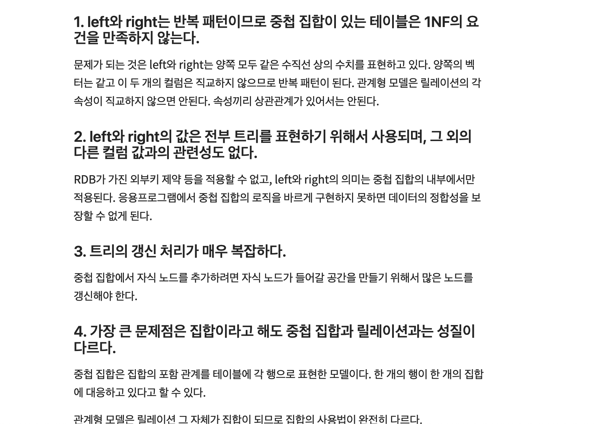

# 5장 : 반복문

> 관계 조작은 관계 전체를 모두 조작의 대상으로 삼는다. 이러한 것의 목적은 반복을 제외하는 것이다.
> 최종 사용자의 생산성을 생각하면 이러한 조건을 만족해야 한다. 그래야만 응용 프로그래머의 생산성에도 기여할 수 있을 것이다.

- SQL은 내부적으로는 반복문을 사용하지만, 구문 자체적으로는 반복문을 사용하지 않는다.

## 반복계와 포장계

- 반복계 : 한 번에 한 레코드 (record at a time)를 반복하는 SQL
- 포장계 : 여러 행을 한꺼번에 처리하는 SQL

### 반복계의 단점

1. 성능
   - 레코드 수가 적다면 반복계가 포장계에 비해 빠를지라도, 많을 경우엔 포장계가 확실히 좋다.
   - SQL 실행의 오버헤드
     - 특히 SQL 구문 파싱 → 실행계획 설계 과정에서 많은 오버헤드가 생긴다.
     - 구문 파싱 : 데이터베이스가 SQL을 받을 때마다 실행하고, DBMS에 따라 최대 0.1초~1초 걸림.
       - SQL문을 반복적으로 실행하는 반복계에선 매 반복
   - 병렬 분산이 힘들다.
     - 반복 1회마다의 처리가 단순한 반복계의 특징 상 병렬 분산 시 효율이 낮다.
   - 데이터베이스의 진화로 인한 혜택을 받을 수 없다.
     - Software Vendor
       - 옵티마이저의 발전 → 효율적인 실행계획 / 데이터에 고속으로 접근할 수 있는 아키텍처 발전
     - Hardware Vendor
       - HDD → SSD : 더 좋은 I/O 성능
         → 하지만 이런 발전들은 “복잡한 SQL 구문을 빠르게 해준다.”
         반복계에서 사용되는 단순한 SQL 구문들은 이런 혜택을 받지 못한다.
2. 해결책이 있을까?
   - 반복계를 포장계로 다시 작성 : 이론은 좋으나 실전에서 사용하기 힘들다. (어떻게 빌딩을 옮겨요..)
   - 각각의 SQL을 빠르게 수정 : 그러기엔 반복계에서 사용하는 SQL 구문이 너무 단순하다..(수정할 게 X)
   - 다중화 처리
     - 리소스 여유 + 처리를 나눌 수 있는 키가 명확하게 정해져 있다면 ⇒ 다중화로 성능 향상
     - 질문 : 위에서 병렬 분산이 힘들다고 했는데, 이게 해결책이 되나? 전제조건이 위에서 말한 병렬 분산의 전제와 정반대라서 그런가?

### 반복계의 장점

> Base : 반복계의 SQL 구문이 단순해서 생기는 장점들이다.

1. 실행 계획의 안정성
   - 실행 계획이 단순하다 == 실행 계획에 변동 위험이 거의 없다.
   - 특히나 결합을 사용하지 않기 때문에 더더욱 안정성 있다.
2. 예상 처리 시간의 정밀도
   - 성능이 안정적 → 예상 처리시간을 정밀하게 예측할 수 있다.
     - <처리 시간> = <한 번의 실행 시간> \* <실행 횟수>
3. 트랜잭션 제어가 편리
   - 각 반복마다 커밋을 했다고 하면, 중간에 오류가 발생하더라도 마지막 커밋시점부터 재개할 수 있다.
   - 포장계에서는 처음부터 다시 해야한다.

# SQL에서 반복을 표현하는 방법

### 1. CASE 함수와 윈도우 함수

```sql
INSERT INTO Sales2
SELECT company, year, sale,
				CASE SIGN(sale - MAX(sale)
										OVER (PARTITION BY company
													ORDER BY year
													ROWS BETWEEN 1 PRECEDING AND 1 PRECEDING) )
				WHEN 0 THEN '='
				WHEN 1 THEN '+'
```

- SIGN 함수 → 더 많은 윈도우 함수 사용을 하나의 상수값 리턴으로 대체.
- ROWS BETWEEN → 직전 레코드를 뽑을 수 있게끔 레코드 제한.

→ 이렇게 CASE문 속에 윈도우 함수를 사용함으로써 반복문을 대체할 수 있다.

### 2. 상관 서브쿼리

> 서브쿼리 내부에서 외부 쿼리와의 결합 조건을 사용하는 기술

```sql
INSERT INTO Sales2
SELECT company, year, sale,
				(SELCT company FROM Sales2
					WHERE S1.company = S2.company
						AND year=(SELECT MAX(year) FROM Sales S3
												WHERE S1.company = S3.company AND S1.year > S3.year)
											) AS pre_company,
				(SELECT sale FROM Sales S2
					WHERE S1.company = S2.company
						AND year=(SELECT MAX(year) FROM Sales S3
												WHERE S1.company = S3.company AND S1.year > S3.year)
											) AS pre_sale
FROM Sales S1;
```

→ 2번째, 3번째 데이터 구하는 것이 어렵고, 실행 계획도 굉장히 복잡해지므로 비추.

## 최대 반복 횟수가 정해진 경우

- 문제
  - 우편번호 ‘4130033’에 최대한 비슷한 레이블 찾기
    | pcode(우편번호) | district_name(지역 이름) |
    | --------------- | ------------------------ |
    | 4130001 | 이즈미 |
    | 4130002 | 이즈산 |
    | 4130103 | 아지로 |
    | 4130041 | 아오바초 |
    | 4103213 | 아오바네 |
    | 4380824 | 아카 |

```sql
# 기본적인 CASE 함수 풀이
SELECT pcode, district_name FROM PostalCode
WHERE CASE WHEN pcode = '4130033' THEN 0
					WHEN pcode = '413003%' THEN 1
					WHEN pcode = '41300%' THEN 2
					WHEN pcode = '4130%' THEN 3
					WHEN pcode = '413%' THEN 4
					WHEN pcode = '41%' THEN 5
					WHEN pcode = '4%' THEN 6
					ELSE NULL END =
								(SELECT MIN(CASE WHEN pcode = '4130033' THEN 0
																	WHEN pcode LIKE '413003%' THEN 1
																	WHEN pcode LIKE '41300%' THEN 2
																	WHEN pcode LIKE '4130%' THEN 3
																	WHEN pcode LIKE '413%' THEN 4
																	WHEN pcode LIKE '41%' THEN 5
																	WHEN pcode LIKE '4%' THEN 6
																	ELSE NULL END)
								FROM PostalCode);

```

- 반복을 지양하고, CASE를 이용한 포장계 방법
- 보다시피 테이블에 접근이 2회 발생한다.
  - 해결책 : 윈도우 함수 사용

```sql
# 윈도우 함수 사용한 CASE문
SELECT pcode, district_name
FROM (SELECT pcode, district_name,
				CASE WHEN pcode = '4130033' THEN 0
					WHEN pcode LIKE '413003%' THEN 1
					WHEN pcode LIKE '41300%' THEN 2
					WHEN pcode LIKE '4130%' THEN 3
					WHEN pcode LIKE '413%' THEN 4
					WHEN pcode LIKE '41%' THEN 5
					WHEN pcode LIKE '4%' THEN 6
					ELSE NULL END AS hit_code,
				MIN(CASE WHEN pcode = '4130033' THEN 0
								WHEN pcode LIKE '413003%' THEN 1
								WHEN pcode LIKE '41300%' THEN 2
								WHEN pcode LIKE '4130%' THEN 3
								WHEN pcode LIKE '413%' THEN 4
								WHEN pcode LIKE '41%' THEN 5
								WHEN pcode LIKE '4%' THEN 6
								ELSE NULL END)
				OVER(ORDER BY CASE WHEN pcode = '4130033' THEN 0
														WHEN pcode LIKE '413003%' THEN 1
														WHEN pcode LIKE '41300%' THEN 2
														WHEN pcode LIKE '4130%' THEN 3
														WHEN pcode LIKE '413%' THEN 4
														WHEN pcode LIKE '41%' THEN 5
														WHEN pcode LIKE '4%' THEN 6
														ELSE NULL END) AS min_code
				FROM PostalCode) Foo
WHERE hit_code = min_code;
```

- 윈도우 함수를 사용하며 정렬이 추가 사용되기 때문에, 테이블 크기가 크다면 오히려 나쁘다.

## 최대 반복 횟수가 정해지지 않은 경우

→ 자료구조를 이용해서 해결해보자.

### 인접 리스트 모델

> 해당 레이블에 연관된 레이블의 키값을 함께 저장하는 방식. 추후에 체이닝을 통해 원하는 레이블까지 찾아갈 수 있다.

→ 보통 재귀 공통 테이블 식(Recursion common table expression)을 통해 해결한다.

<aside>
💡 그러나..책 기준 MySQL에는 재귀 공통 테이블 식을 미지원한다는 내용이 있군요
→ 하지만! 8.0에는 WITH 키워드로 구현되었다는 사실 😊

[MySQL :: MySQL 8.0 Reference Manual :: 13.2.20 WITH (Common Table Expressions)](https://dev.mysql.com/doc/refman/8.0/en/with.html)

</aside>

### 중첩 집합 모델

> 각 레코드의 데이터를 집합으로 보고, 계층 구조를 집합의 중첩 관계로 나타내어 조회

- 재귀 연산을 사용하지 않는다. 원의 좌측위치, 우측위치를 저장한 다음, 해당 원(집합)의 포함관계를 통해 찾아내는 모델.

### 단점


