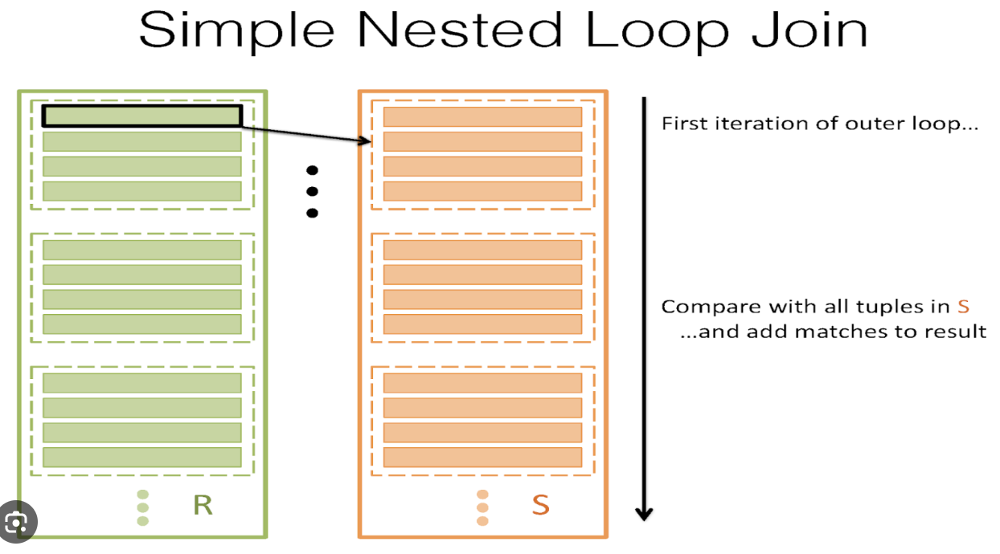

# 6장 : 결합

# 결합의 종류

> 크로스 결합, 내부 결합, 외부 결합, 자기 결합, 등가/비등가 결합, 자연 결합
> 

## 기능적 관점으로의 결합 분류

1. 크로스 결합 (=데카르트 곱)
    
    n개 레코드의 A 테이블과 m개 레코드의 B 테이블을 결합할 때, 모든 경우의 수(n*m)를 결합.
    
    - 모든 경우의 수가 필요한 경우가 드물고, 비용이 많이 들기 때문에 실무에선 거의 사용하지 않는다.
    - 개발자의 실수로부터 사용되는 경우를 많이 볼 수 있다.
        - `SELECT * FROM Employees, Departments;`
            - 결합 조건이 없기 때문에 크로스 결합으로 계산된다.
    
    ```sql
    SELECT * FROM Employees
    CROSS JOIN Departments;
    ```
    
2. 내부 결합 (Inner Join)
    - ‘내부’의 뜻 : ‘크로스 결합의 부분집합’
    - 결합 키가 양쪽 테이블 모두에 존재하는 레코드들만 추출
    
    ```sql
    SELECT E.emp_id, E.emp_name, E.dept_id, D.dept_name
    FROM Employees E INNER JOIN Departmnts D
    ON E.dept_id = D.dept_id;
    ```
    
    - 상관 서브쿼리로 대체할 수도 있다.
        
        ```sql
        SELECT E.emp_id, E.emp_name, E.dept_id,
        	(SELECT D.dept_name FROM Departments D
        		WHERE E.dept_id=D.dept_id) AS dept_name
        FROM Employees E;
        ```
        
        - `dept_name` 테이블의 기본 키와 `Employee` 테이블의 기본 키가 같은 레이블들만 포함되게끔 WHERE문 설정 → INNER JOIN과 동일하다.
3. 외부 결합 (Outer Join)
    - ‘외부’의 뜻 = ‘내부’가 아닌 = ‘크로스 결합의 부분집합’이 아닌.
        - 그러나 때때로는 데카르트 곱의 부분집합이 되기도 한다.
    - 마스터 테이블의 정보를 모두 보존하고자 NULL을 생성한다는 것이 핵심적인 차이.
    - 종류
        - 왼쪽 외부결합 (LEFT OUTER JOIN)
            
            ```sql
            SELECT E.emp_id, E.emp_name, E.dept_id, D.dept_name
            FROM Departments D LEFT OUTER JOIN Employees E
            ON D.dept_id = E.dept_id;
            ```
            
        - 오른쪽 외부결합 (RIGHT OUTER JOIN)
            
            ```sql
            SELECT E.emp_id, E.emp_name, E.dept_id, D.dept_name
            FROM Employees E RIGHT OUTER JOIN Departments D
            ON D.dept_id = E.dept_id;
            ```
            
            - 왼쪽, 오른쪽은 사실 똑같다. 마스터가 되는 테이블을 왼쪽에 적느냐, 오른쪽의 적느냐의 차이.
            - 마스터 테이블 쪽에만 존재하는 키가 있을 때는 해당 키를 제거하지 않고 결과에 보존.
            - 키를 모두 가진 레이아웃의 리포트를 만들 때 자주 사용.
        - 완전 외부결합 (FULL OUTER JOIN)
            - Mysql에선 지원하지 않는다.
                - 필요하다면 `LEFT UNION RIGHT`으로 우회할 수 있다.
            - LEFT OUTER JOIN + RIGHT OUTER JOIN이라고 생각하면 된다.

### 자기 결합 (Self Join)

- 자기 자신과 결합하는 연산.
- 기능적 분류에는 들지 못한다. (생성 결과가 기준이 아닌, 무엇을 대상으로 연산하는지에 대한 기준)
- 물리 레벨에서 보면 같은 테이블과 결합, 논리 레벨에서 보면 서로 다른 두 테이블 결합.

```sql
SELECT D1.digit + (D2.digit * 10) AS seq
FROM Digits D1 CROSS JOIN Digits D2;
```

# 결합 알고리즘과 성능

> Optimizer → 데이터 크기나 결합 키의 분산이라는 요인에 의존하여 알고리즘 선택
> 

## Optimizer가 선택 가능한 결합 알고리즘

1. Nested Loops
2. Hash
3. Sort Merge

## 1. Nested Loops

중첩 반복을 사용하는 알고리즘 (마치 2중 반복문)



1. 결합 대상 테이블 (Driving table)에서 레코드를 하나씩 반복 스캔
2. Driving Table의 레코드 하나마다 내부 테이블(Inner Table / Driven Table)의 레코드를 하나씩 스캔 후 결합 조건에 맞으면 리턴
3. Driving Table의 모든 레코드에 반복

→ Driving Table’s Record: m , Drivne Tables’s Record: n ⇒ m*n

### 장점

1. 한 번의 단계에서 처리하는 레코드 수가 적으므로 Hash, Sort Merge에 비해 메모리소비 적다.
2. 모든 DBMS에서 지원
3. 구동 테이블이 작을수록 Nested Loops의 성능이 좋아진다.

### 구동 테이블의 중요성

> 구동 테이블이 작을수록 Nested Loops의 성능이 좋아진다.
> 
- 조건
    1. 내부 테이블의 결합 키 필드에 인덱스가 존재할 때 좋다
    2. 내부 테이블의 결합 키가 내부 테이블에 대해 유일할수록 좋다

성능 = (# of Records in Table A) * 2(1 Driving Table Record + 1 Indexed Driven Table Record)

### 단점

1. 결합 키로 내부 테이블에 접근할 때 히트되는 레코드가 많으면 성능이 떨어진다.
2. 결국엔 반복문이다. 내부 테이블의 절대적인 레코드 양이 많다면 지연이 발생한다.
    - 해결책
        1. 구동 테이블로 큰 테이블을 선택해보자.
        (전제 : 현재 내부 테이블의 결합 키가 유일하지 않을 때)
        2. 해시 알고리즘으로 구현해보자.

## 2. Hash

### 작동 과정

1. 작은 테이블을 스캔하고, 결합 키에 해시 함수를 적용해서 해시값으로 변환한다.
2. 다른 테이블(상대적으로 큰 테이블)을 스캔하고, 결합 키가 해시값에 존재하는지 확인

### 왜 작은 테이블에 해시값을 걸까?

1장 → 해시 테이블은 DBMS의 워킹 메모리에 저장된다. 따라서 워킹 메모리에 조금이라도 작은 것이 저장되는게 효율적이다.

### 특징

1. 결합 테이블로부터 해시 테이블을 만들어서 활용하므로, Nested Loops에 비해 메모리를 크게 소모한다. (먼저 스캔한 테이블만큼의 메모리를 하나 더 만드는 셈)
2. 메모리가 부족하면 저장소를 사용 → 지연
3. 출력되는 해시값은 입력값의 순서를 알지 못한다. 따라서 동치 결합에만 사용할 수 있다.

### Hash 사용하기 좋은 경우

1. Nested Loops에서 적절한 구동 테이블이 존재하지 않는 경우. 즉 두 테이블 간의 레이블 수가 크게 차이나지 않는 경우
2. 두 테이블 간 레이블 수가 크게 차이난다 할지라도, 내부 테이블에서 히트되는 레코드 수가 너무 많은 경우
3. Nested Loops의 내부 테이블에 인덱스가 존재하지 않는 경우

즉, Nested Loops가 별로면 대안으로서 Hash가 존재한다.

### Hash의 단점

1. 메모리 소비량이 많기 때문에, 동시 실행성이 높은 처리를 할 때 메모리 부족에 조심해야 한다.
2. OLTP 처리를 할 때 hash 사용은 지양해야 한다. (For 지연)
3. Hash는 반드시 양쪽 테이블의 레코드를 Full Scan한다. 테이블의 규모가 굉장히 크다면 스캔 시간을 고려해야 할 것.

## 3. Sort Merge

### 작동 과정

1. 결합 대상 테이블 2개 모두를 각각 결합 키로 정렬한다.
2. (투 포인터 알고리즘처럼) 결합 대상 테이블들을 스캔하며, 일치하는 결합 키를 찾으면 결합한다.

### 특징

1. 대상 테이블을 모두 정렬해야 한다. → 많은 메모리 소비
2. Hash보다도 메모리 소비가 많다. (Hash는 해시값 처리를 위해 한 테이블만 소비, 얘는 두개 다 소비)
    - 메모리 부족 → TEMP 탈락 → I/O 비용 늘어남 → 지연 발생 위험
3. 동치 결합뿐만 아니라 부등호를 사용한 결합에도 사용 가능하다. (부정 조건(`<>`) 제외)
4. 테이블이 결합 키로 정렬되어 있다면 정렬 생략 가능.
    - 전제 : SQL에서 테이블에 있는 레코드의 물리적인 위치를 알고 있을 때
5. 테이블을 정렬하므로 한쪽 테이블을 모두 스캔한 시점에 결합 완료 (Merge Sort의 특징)

## 의도하지 않은 크로스 결합

```jsx
SELECT A.col_a, B.col_b, C.col_c
FROM Table_A A
	INNER JOIN Table_B B
		ON A.col_a = B.col_b
	INNER JOIN Table_C C
		ON A.col_a = C.col_c;
```


결합 과정에서 옵티마이저가 어떤 알고리즘을 선택하는가에 따라 결정되지만, 크게 2가지 방법이 있다.

1. Nested Loops로 선택
    - 최선의 방법. GOOD
2. Cross Join을 선택
    - 비효율적인 성능
    - 옵티마이저가 크로스 결합을 선택하는 이유 (추측)
        1. 구현상의 이유
        2. Table B와 Table C의 크기를 작다고 평가했을 수도..?
        3. 이번 쿼리 전에 이미 비슷한 테이블을 가지고 크로스결합을 선택했었을 가능성

### 의도하지 않은 크로스 결합을 회피하는 방법

> B와 C를 의도적으로 걸어주면 된다..
> 

# 정리

1. 소규모 - 소규모
    - 뭘 사용해도 GOOD
2. 소규모 - 대규모
    - Nested Loops 먼저 해보되, 내부 테이블의 결합 대상 레코드가 많거나 애초에 아예 레코드가 많을때는 Hash 검토
3. 대규모 - 대규모
    - Hash 사용
    - 정렬이 이미 좀 되어있다? Nested Loops 사용

Join 연산에서 실행계획의 변동이 가장 잘 발생할 수 있다.

따라서, SQL 성능의 변동 위험을 줄이려면 되도록 결합을 피해야 한다.